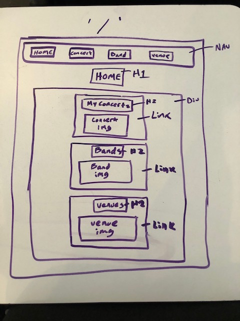
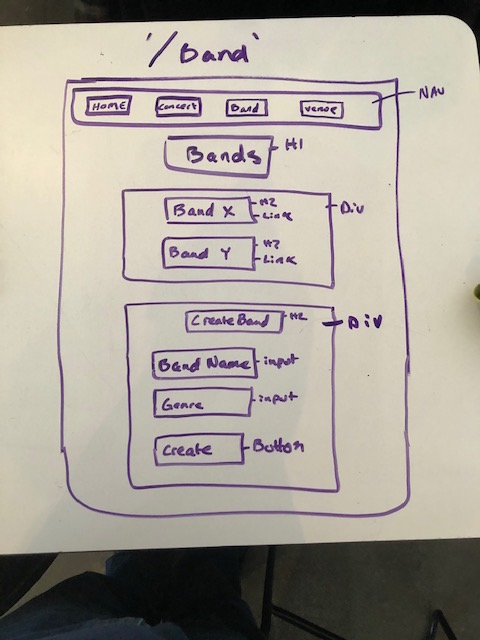
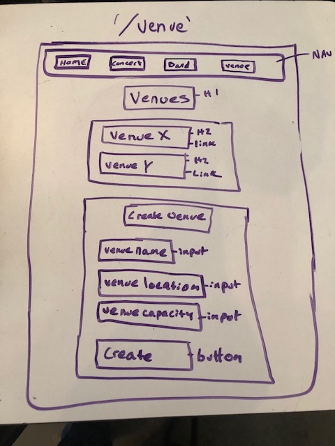

# Concert Recall

---------------------------------------

## Project Explanation: 

Purpose of project as a problem statement:  
This site/application allows concert goers to document their past live shows they have attended. Also allows music lovers to view past live shows from their favorite bands in one space. Lastly shows users information on concert venues. 

Target end user:  
My target end user is music lovers and concert goers.  This allows concert lovers to view past live shows from their favorite bands and view information on their favorite venues.  Also allows users to document live shows they have been to and upload text, such as set lists or interesting notes about about the show, as well as input photos and videos from their experience at shows. Eventually this may also be a place for bands to interact with their fans.

-------------------------------------------------------------------

## Heroku: 
https://sykes-project-3.herokuapp.com/

-------------------------------------------------------------------

## Trello : 
https://trello.com/b/ll7x5gw0/project-3

-------------------------------------------------------------------

## ERD
 

-------------------------------------------------------------------

## Wireframes

/
 

/concert
 

/concert/:concertId
 

/band
 

/band/:bandId
 

/venue
 

/venue/:venueId
 

